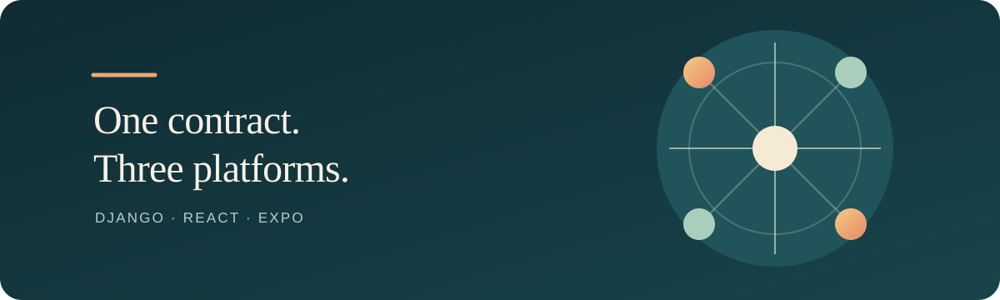
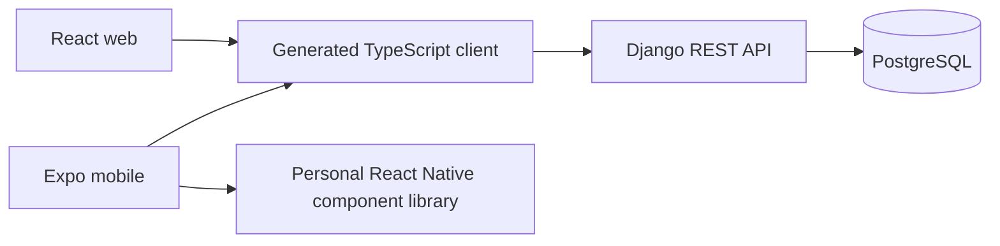

<p align="center">
  
</p>

<h1 align="center">Full-stack product template</h1>

<p align="center">A Django API, React web app and Expo mobile app connected by one generated OpenAPI contract.</p>

<p align="center">
  
  
  
</p>

## Quick start

Requirements: Git, Docker Compose v2, Node.js 24, Corepack, Python 3.13 and uv.

```sh
git clone https://github.com/pianic2/template-fullstack.git my-product
cd my-product
cp .env.example .env
make init
make setup
make dev
```

On a fresh database, run `make migrate` in a second terminal after the backend starts. The web app is at `http://localhost:5173`; the API is at `http://localhost:8000`. Run the Expo app on the host with `corepack pnpm --filter @template/mobile start`.

## Architecture



Django owns HTTP behavior and persistence. `openapi/openapi.yaml` is the client contract; Orval generates the shared Fetch client. The web and mobile apps own their platform UI, and `packages/shared` contains platform-neutral TypeScript.

## Development

| Command | Purpose |
| --- | --- |
| `make help` | List available Make targets |
| `make doctor` | Check local tools and configuration |
| `make down` | Stop development services |
| `make logs` | Follow Compose logs |
| `make dev-email` | Start the optional Mailpit profile |
| `make lint` | Run Python and JavaScript lint checks |
| `make typecheck` | Type-check backend and TypeScript workspaces |

PostgreSQL is the supported database. Migrations are committed and run with `make migrate`; they are not applied at application startup. Expo runs on the host, outside Compose.

## Testing

Run `make test` for backend, web, mobile and bootstrap tests. `make check` runs the repository quality gates, including API drift and Docker configuration checks; it requires Docker and a PostgreSQL service for backend tests.

## API and authentication

Django REST Framework and drf-spectacular define the API. After changing routes or serializers, regenerate the schema and client in order:

```sh
make api-schema
make api-client
make api-check
```

Do not edit generated client files by hand. Browser authentication uses Django session cookies and CSRF protection; mobile uses short-lived JWTs stored with Expo SecureStore.

## Documentation

- [Documentation index](docs/README.md)
- [Architecture overview](docs/architecture/overview.md)
- [API contract](docs/architecture/api-contract.md) · [Authentication](docs/architecture/authentication.md)
- [Development setup](docs/development/setup.md) · [Mobile development](docs/development/mobile.md)
- [Production deployment](docs/deployment/production.md) · [Upgrade policy](docs/upgrades.md)
- [Agent workflow](docs/agents/overview.md) · [Deterministic skill discovery](docs/agents/skills.md)

## Deployment

Deployment images and production Compose configuration are documented in [the production guide](docs/deployment/production.md). Use explicit HTTPS origins, a managed PostgreSQL service and a secret manager for production settings.

## Project structure

| Path | Contents |
| --- | --- |
| `apps/backend/` | Django API and PostgreSQL tests |
| `apps/web/` | React web application |
| `apps/mobile/` | Expo app using the personal component library |
| `packages/api-client/` | OpenAPI-generated TypeScript client |
| `packages/shared/` | Platform-neutral TypeScript |
| `openapi/` | Committed API schema |
| `docs/` | Architecture, setup, deployment and agent guides |

## Template setup

Use GitHub **Use this template**, then run `make init` in the new clone. For non-interactive setup:

```sh
python3 scripts/bootstrap.py --name "Acme Video" --slug acme-video \
  --python-package acme_video --bundle-id com.acme.video --non-interactive
```

`make init` and the bootstrap script rename the documented product identity values; they do not change the component package version.
