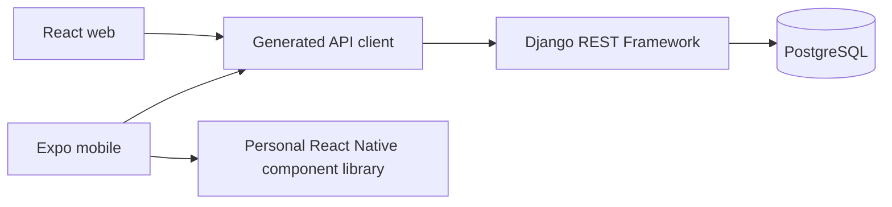

# Architecture overview

The repository is a product template organized as a pnpm monorepo. Django owns HTTP behavior and persistence; React web and Expo mobile provide separate platform interfaces. Both clients use the TypeScript Fetch client generated from the committed OpenAPI contract.

## Package boundaries

- `apps/backend` owns Django models, migrations, serializers, views and authentication.
- `apps/web` owns DOM rendering and browser behavior.
- `apps/mobile` owns Expo routes and product-specific native screens. Generic native primitives belong in `@personal-library/react-native-components`.
- `packages/api-client` contains the Orval-generated client. Change Django behavior and the OpenAPI source, then regenerate it; do not hand-edit generated output.
- `packages/shared` is limited to platform-neutral TypeScript and must remain Node-free.

PostgreSQL is the supported database. Development services run in Compose; Expo runs on the host to connect to simulators and devices. Mailpit is an optional Compose profile. S3-compatible storage is an optional backend extra configured against a product-owned endpoint. No queue framework is included by default.

Production images are provided for the Gunicorn backend and static Nginx web app. TLS termination, managed PostgreSQL, secrets and production infrastructure are configured by the deploying product. See [production deployment](../operations/production-deployment.md).
